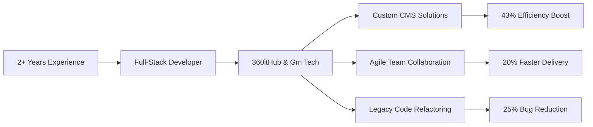

<div align="center">

# 👨‍💻 Aashish Timalsina


<p align="center">
  <a href="https://www.linkedin.com/in/aashish-timalsina-29a866267">
    
  </a>
  <a href="mailto:aashish.timalsina@metropolia.fi">
    
  </a>
  <a href="https://my-portfolio-ivory-two-7drypsak8m.vercel.app">
    
  </a>
</p>


</div>

---

## 🎯 About Me

```typescript
const aashish = {
    location: "📍 Espoo, Finland",
    education: "🎓 B.Eng in Software Engineering @ Metropolia UAS",
    experience: "💼 2+ Years Professional Development",
    currentFocus: "🔭 GenAI Applications & Agentic Workflows",
    
    impact: {
        efficiency: "↗️ 43% operational improvement",
        quality: "🐛 25% reduction in production bugs",
        delivery: "⚡ 20% faster feature shipping"
    },
    
    mission: "Building scalable, human-centric software that makes a difference 🌍"
};
```

<div align="center">
  
### 💡 _"Bridging the gap between robust Full-Stack development and cutting-edge AI"_

</div>

---

## 🛠️ Tech Arsenal

<div align="center">

### Frontend Magic ✨


### Backend Power ⚡


### AI & Data Science 🤖


### Databases 💾


### DevOps & Tools 🔧


</div>

---

## 🌟 Featured Projects

<div align="center">

<table>
<tr>
<td width="50%">

### 🤖 Metropolia AI Hub
**AI-Powered Academic Assistant**

> Revolutionary RAG pipeline providing context-aware academic support

[](https://github.com/aashish0770/metropoli_ai_hub)

**Tech Stack:**
- Python & LangChain
- ChromaDB Vector Search
- OpenAI/Gemini APIs
- Streamlit UI

**Highlights:**
- ✅ Intelligent document retrieval
- ✅ Context-aware responses
- ✅ Real-time academic assistance

</td>
<td width="50%">

### 🏨 BookMeWorld
**Enterprise Booking Platform**

> Multi-vendor system revolutionizing hotel & event reservations

[](https://bookmeworld.com/)

**Tech Stack:**
- React.js & Node.js
- Express.js
- MongoDB

**Highlights:**
- ✅ Optimized query performance
- ✅ Scalable architecture
- ✅ Real-time availability

</td>
</tr>
<tr>
<td width="50%">

### 🎬 RodhiFlix
**Community Streaming Platform**

> High-performance video platform with advanced RBAC

[](https://rodhiflix.com/auth/login)

**Tech Stack:**
- React.js & Node.js
- Express.js & CSS3
- Role-Based Access Control

**Highlights:**
- ✅ Seamless video streaming
- ✅ Custom content management
- ✅ Responsive UI/UX

</td>
<td width="50%">

### 🚀 More Projects Coming Soon...
**Always Building**

> Exploring new technologies and solving real-world problems

**Current Focus:**
- 🔭 Advanced AI Agents
- ☁️ Cloud Architecture
- 🐹 Learning Go
- 🐳 Docker & CI/CD

</td>
</tr>
</table>

</div>

---

## 💼 Professional Journey

<div align="center">



</div>

### 🎯 Key Achievements

<table>
<tr>
<td align="center" width="33%">

### 📈 43%
**Operational Efficiency**

Streamlined content delivery & architected scalable CMS solutions

</td>
<td align="center" width="33%">

### 🐛 25%
**Bug Reduction**

Enhanced code quality through comprehensive refactoring

</td>
<td align="center" width="33%">

### ⚡ 20%
**Faster Shipping**

Agile collaboration & optimized development workflows

</td>
</tr>
</table>

---

## 📊 GitHub Stats

<div align="center">


</div>

---

## 🌱 Current Learning Path

<div align="center">

| 🎯 Focus Area | 📚 Learning | 🚀 Status |
|:---:|:---:|:---:|
| **AI Agents** | Advanced Agentic Workflows | 🔥 Active |
| **Cloud Native** | Docker & Kubernetes | 📖 Learning |
| **Backend** | Go (Golang) | 🌱 Exploring |
| **DevOps** | CI/CD Pipelines | ⚙️ Implementing |

</div>

---

## 💬 Let's Connect!

<div align="center">

### 🤝 Open to collaborations, discussions, and coffee chats!

<p>
  <a href="https://www.linkedin.com/in/aashish-timalsina-29a866267">
    
  </a>
  <a href="mailto:aashish.timalsina@metropolia.fi">
    
  </a>
  <a href="https://my-portfolio-ivory-two-7drypsak8m.vercel.app">
    
  </a>
</p>

### 💡 Ask me about:
**React State Management** • **RAG Implementation** • **Full-Stack Architecture** • **Life in Finland** ☕


---

### ⭐ _"Building scalable solutions, one commit at a time"_


</div>
